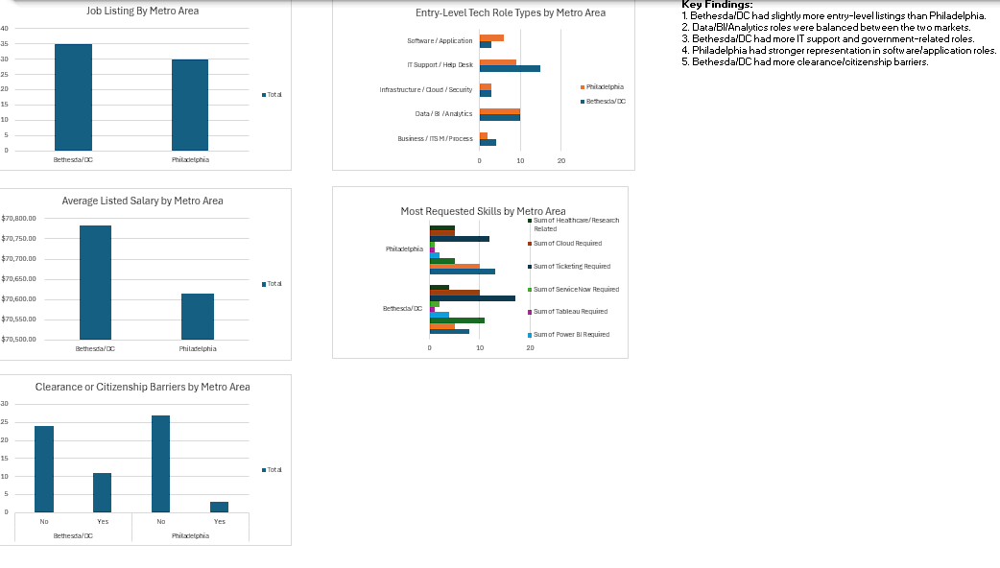
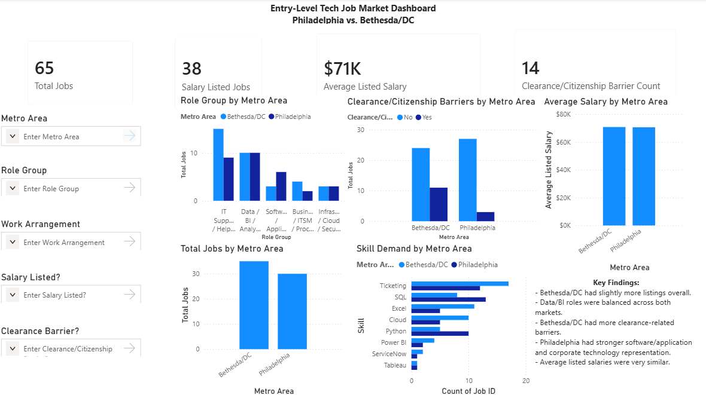

# Entry-Level Tech Job Market Dashboard: Philadelphia vs. Bethesda/DC

## Project Overview


This project compares entry-level technology job opportunities in two metro areas I am considering after graduation: **Philadelphia, PA** and **Bethesda/Washington, DC**. The goal was to better understand which area has more relevant early-career roles for someone with a Computer Science background, as well as what skills, salary ranges, and job requirements appear most often.

I collected job listings from LinkedIn, Indeed, and company career sites, then organized the data into a structured spreadsheet. I used Excel, PivotTables, and charts to analyze job availability, role categories, technical skill demand, salary information, and clearance or citizenship barriers.

## Tools Used

- Microsoft Excel
- PivotTables
- PivotCharts
- Manual data collection
- Data cleaning and categorization

## Dataset

The main dataset includes **65 entry-level or early-career technology job listings**:

- **35 listings** from the Bethesda/DC area
- **30 listings** from the Philadelphia area

A separate sheet includes **stretch roles**, which were jobs that were related to the project but did not fully fit the main entry-level criteria. These roles were separated because they often required more experience, active security clearances, or were less realistic from a commuting standpoint.

## Key Questions

This project was designed to answer the following questions:

1. Which metro area had more entry-level technology job listings?
2. What types of technology roles were most common in each area?
3. Which technical skills appeared most often in job descriptions?
4. How did listed salaries compare between the two metro areas?
5. Were clearance or U.S. citizenship requirements more common in one area?
6. Which market appears to be the better fit for my background and career goals?

## Dashboard Features

The dashboard includes charts for:

- Total job listings by metro area
- Role category comparison by metro area
- Average listed salary by metro area
- Technical skill demand by metro area
- Clearance/citizenship barriers by metro area

## Key Findings

- Bethesda/DC had slightly more listings overall than Philadelphia.
- Data, BI, and analytics roles were balanced between the two markets.
- Bethesda/DC had more IT support, infrastructure, government contractor, and clearance-related roles.
- Philadelphia had stronger representation in software/application support, healthcare IT, fintech, and corporate technology roles.
- Average listed salaries were very similar between the two areas.
- Bethesda/DC had more clearance and citizenship-related requirements, while Philadelphia appeared more accessible for candidates without existing clearance.

## Salary Analysis

For jobs that included salary ranges, I calculated the midpoint between the minimum and maximum salary values. I then used those midpoint values to estimate the average listed salary for each metro area.

Average listed salary:

- **Bethesda/DC:** $70,783.92
- **Philadelphia:** $70,614.77

Because not all job postings included salary information, this should be treated as a rough estimate rather than a complete salary analysis.

## Skills Tracked

The project tracked whether each job listing mentioned or required the following skills/tools:

- SQL
- Python
- Excel
- Power BI
- Tableau
- ServiceNow
- Ticketing systems
- Cloud tools
- Power BI
- DAX measures
- Power Query

These skills were tracked using binary indicators, where `1` means the skill appeared in the listing and `0` means it did not.

## Power BI Dashboard

I recreated the original Excel dashboard in Power BI to make the project more interactive and portfolio-ready. The Power BI version includes slicers for metro area, role group, work arrangement, salary availability, and clearance/citizenship barriers.



## Project Files

```text
Job-Market-Dashboard/
│
├── data/
│   ├── main_jobs.csv
│   └── stretch_roles.csv
│
├── dashboard/
│   └── Job Dashboard Spreadsheet.xlsx
│
├── powerbi/
│   └── Job_Market_Dashboard.pbix
│
├── report/
│   └── Job Dashboard Report.pdf
│
├── images/
│   ├── dashboard_overview.png
│   ├── powerbi_dashboard_overview.png
│   ├── role_group_by_metro.png
│   ├── skill_demand_by_metro.png
│   ├── clearance_citizenship_barriers.png
│   └── average_listed_salary_by_metro.png
│
└── README.md

